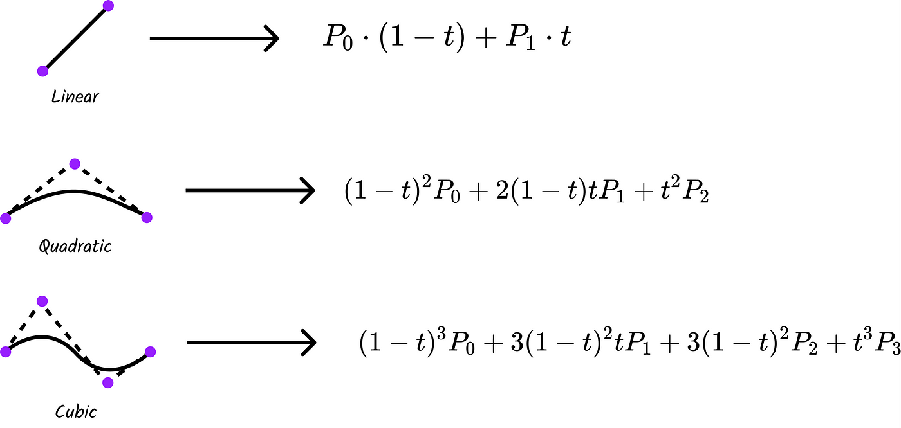

# Detecting Cars' Paths in a Maze

**Author:** Demetre Labadze

**Date:** [Current Date]

## Introduction

Can you guess a car's path based on the points it is going to cross? With this software, the answer is "yes." This project allows you to recreate a car's path using Bezier curves and De Casteljau's algorithm to connect the dots.

## Usage

To use this software, follow these steps:

1. Run the `maze.py` script.
2. Click on the image of the maze to select the points through which the car will pass.
3. After choosing all the points, press 'q' to finalize the selection.
4. The software will draw the path that the car will follow.

## How It Works

The software simulates a car's path through a maze using Bezier curves. Bezier curves are mathematical curves that can smoothly connect a series of control points. The De Casteljau's algorithm is used to generate these Bezier curves.

Here's a simplified representation of how it works:

1. You select the points on the maze that the car will pass through by clicking on the image.
2. These selected points become the control points for the Bezier curves.
3. The De Casteljau's algorithm connects these control points smoothly to create the car's path.
4. The result is a smooth, continuous path that the car can follow.

## Project Status

Please note that this project is still a work in progress. It does not yet fully implement all features, and there may be issues. Your contributions are welcome! Feel free to explore the code, suggest improvements, and implement new features. You can check the project's GitHub repository for open issues and submit pull requests to help us enhance the software.

This project is an opportunity to learn, experiment, and collaborate with others in the programming and computer graphics community. We look forward to your contributions and ideas.
